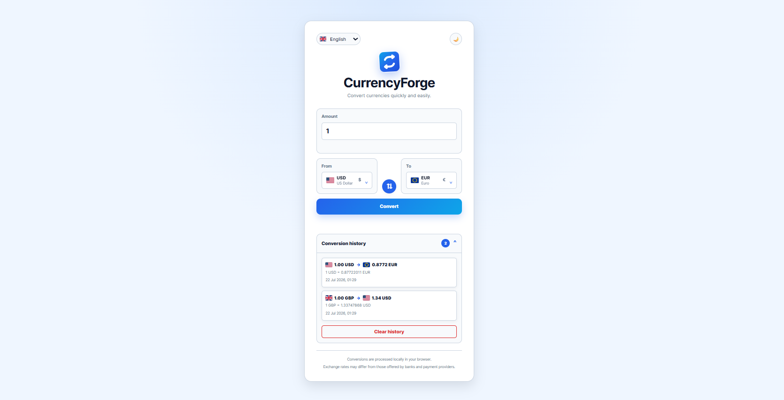
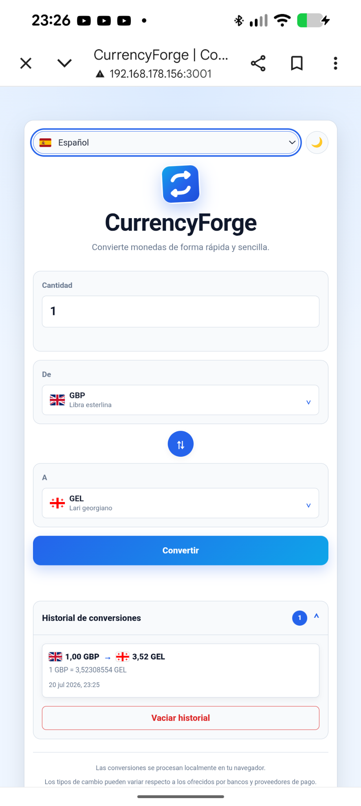

<div align="center">


# CurrencyForge

### 💱 Modern, fast and accessible currency converter

A modern currency converter built with Vanilla JavaScript featuring real-time exchange rates, favorites, conversion history, internationalization, accessibility and Progressive Web App (PWA) support.

<br>

<p align="center">


</p>

<p align="center">

A lightweight currency converter built with **Vanilla JavaScript**, focused on **performance**, **accessibility**, and **Progressive Web App** technologies.

</p>

</div>

---

## 🚀 Live Demo

> Coming soon... *(GitHub Pages deployment will be available after publication.)*

---

## 📸 Screenshots

### Desktop



### Mobile



---

## ✨ Features

- 💱 Real-time currency conversion
- ❤️ Favorite currencies
- 📜 Conversion history
- 🌍 English and Spanish interface
- 🎨 Light and dark themes
- 📱 Fully responsive design
- ⚡ Progressive Web App (PWA)
- 📦 Offline support powered by Service Worker
- ♿ Accessibility improvements
- 🏳️ SVG-based language selector
- 🔢 Adaptive number formatting

---

## 🛠️ Technologies

- HTML5
- CSS3
- Vanilla JavaScript (ES6+)
- ExchangeRate API
- LocalStorage
- Web App Manifest
- Service Worker
- Git & GitHub

---

## 📦 Installation

Clone the repository:

```bash
git clone https://github.com/TU-USUARIO/CurrencyForge.git
```

Navigate to the project folder:

```bash
cd CurrencyForge
```

Run the project using your preferred local web server.

For example:

```bash
npx serve .
```

or

```bash
python -m http.server
```

Then open the address provided by your local server in your browser.

---

## 📱 Progressive Web App

CurrencyForge is built as a Progressive Web App (PWA), providing an app-like experience on desktop and mobile devices.

### Features

- 📦 Installable on supported devices
- ⚡ Offline functionality powered by Service Worker
- 📄 Web App Manifest
- 🎨 Adaptive and maskable icons
- 🚀 Fast loading through asset caching

---

## ♿ Accessibility

Accessibility has been considered from the beginning of the project to provide an inclusive experience for all users.

Implemented improvements include:

- Semantic HTML structure
- Keyboard navigation
- Visible focus indicators
- ARIA attributes where appropriate
- Accessible interactive elements
- Improved screen reader compatibility

---

## 🌍 Internationalization

CurrencyForge currently supports two languages:

- 🇬🇧 English
- 🇪🇸 Spanish

The interface can be switched instantly without reloading the page, providing a seamless multilingual experience.S

---

## 📂 Project Structure

```text
CurrencyForge/
│
├── assets/
│   ├── icons/
│   └── screenshots/
│
├── CSS/
│   ├── components/
│   └── styles.css
│
├── img/
│   └── flags/
│
├── js/
│
├── index.html
├── manifest.webmanifest
├── service-worker.js
└── README.md
```

---

## 🚀 Roadmap

Future improvements planned for CurrencyForge include:

- [ ] Support for additional languages
- [ ] Historical exchange rates
- [ ] Interactive exchange rate charts
- [ ] More customization options
- [ ] Performance optimizations

---

## 📄 License

This project is licensed under the MIT License.

See the LICENSE file for more information.

---

## 👨‍💻 Author

Developed with ❤️ by **Ángel González**.

If you enjoyed this project, consider giving it a ⭐ on GitHub.